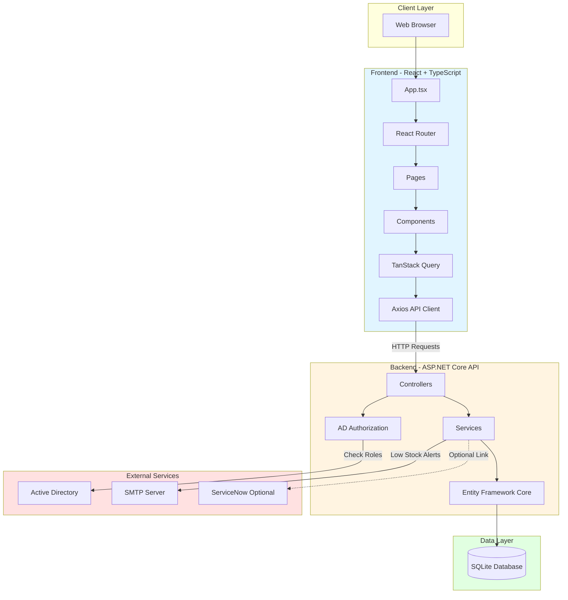
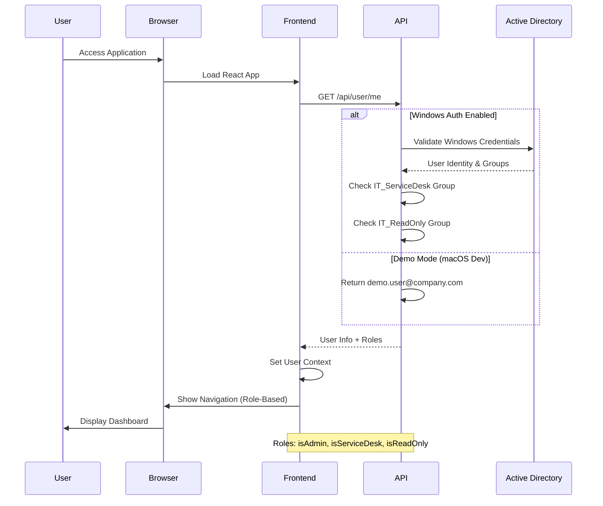
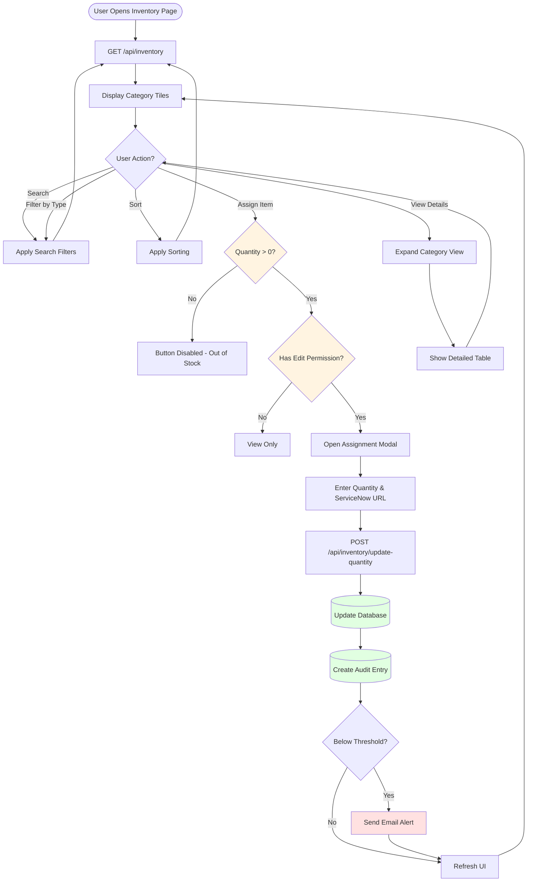
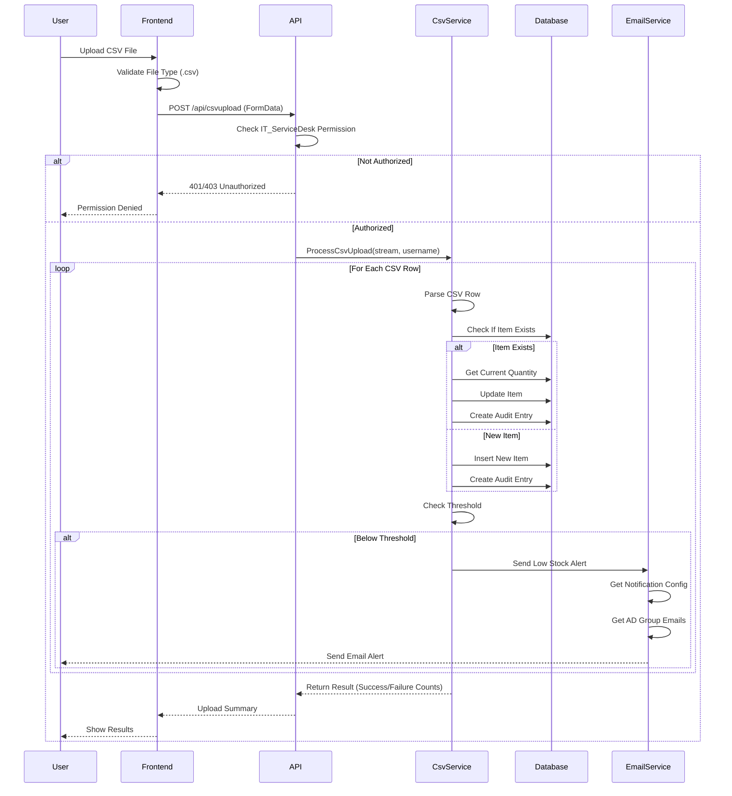
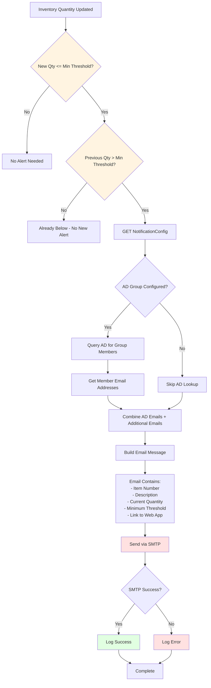
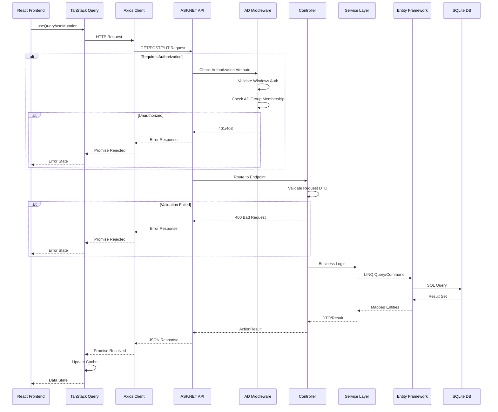
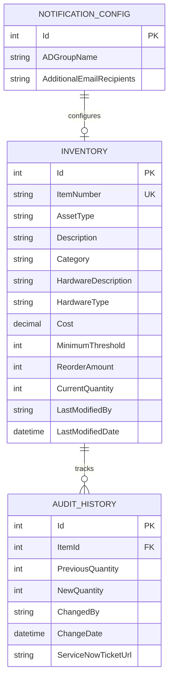
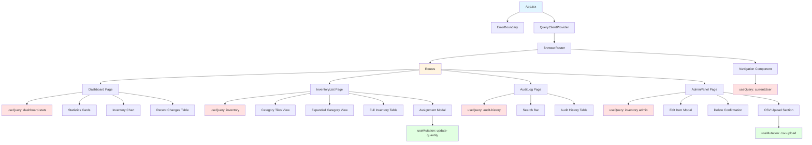
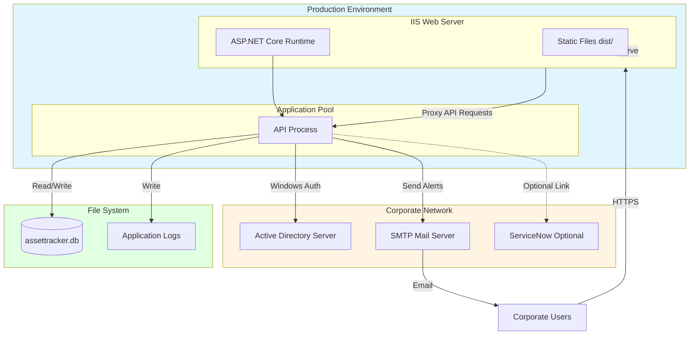

# ITS Asset Tracker - Architecture & Flow Diagrams

## 1. System Architecture Overview

## 2. User Authentication & Authorization Flow

## 3. Inventory Management Flow

## 4. CSV Upload Flow

## 5. Audit History Flow

```mermaid
flowchart LR
    subgraph Triggers["Audit Trail Triggers"]
        CSV[CSV Upload]
        Manual[Manual Assignment]
        AdminUpdate[Admin Panel Update]
    end

    subgraph AuditCreation["Audit Entry Creation"]
        GetPrevQty[Get Previous Quantity]
        GetNewQty[Get New Quantity]
        GetUser[Get Username]
        GetTimestamp[Get Timestamp]
        GetTicket[Get ServiceNow URL Optional]
    end

    subgraph Database["Database Operations"]
        InsertAudit[(Insert AuditHistory Record)]
        LinkItem[(Link to Inventory Item)]
    end

    subgraph Display["Audit Log Display"]
        Query[GET /api/inventory/audit-history]
        Search[Search Filter Optional]
        Limit[Limit Results Optional]
        ShowTable[Display Audit Table]
    end

    CSV --> GetPrevQty
    Manual --> GetPrevQty
    AdminUpdate --> GetPrevQty

    GetPrevQty --> GetNewQty
    GetNewQty --> GetUser
    GetUser --> GetTimestamp
    GetTimestamp --> GetTicket

    GetTicket --> InsertAudit
    InsertAudit --> LinkItem

    LinkItem -.-> Query
    Query --> Search
    Search --> Limit
    Limit --> ShowTable

    style Database fill:#e1ffe1
    style AuditCreation fill:#fff4e1
    style Display fill:#e1f5ff
```

## 6. Email Alert System Flow

## 7. API Request Flow (Detailed)

## 8. Database Entity Relationships

## 9. Component Hierarchy (Frontend)

## 10. Deployment Architecture

---

## Key Design Patterns

### Frontend
- **State Management**: TanStack Query for server state, React hooks for local state
- **Component Pattern**: Functional components with hooks
- **API Integration**: Centralized Axios instance with interceptors
- **Routing**: Declarative routing with React Router v6
- **Error Handling**: Error boundaries and query error states

### Backend
- **Architecture**: Layered architecture (Controllers → Services → Data)
- **Authorization**: Middleware-based AD group authorization
- **Data Access**: Repository pattern via Entity Framework Core
- **Email**: Service layer abstraction for SMTP
- **Logging**: Built-in ASP.NET Core logging

### Security
- **Authentication**: Windows Authentication (NTLM/Kerberos)
- **Authorization**: Role-based via AD groups
- **Audit Trail**: Complete logging of all data changes
- **SQL Injection**: Protected via EF Core parameterized queries
- **XSS**: React auto-escaping + Content Security Policy

---

## Performance Considerations

1. **Caching**: TanStack Query provides automatic caching
2. **Pagination**: Implemented for large datasets
3. **Indexing**: Database indexes on ItemNumber and foreign keys
4. **Query Optimization**: EF Core LINQ queries optimized
5. **Connection Pooling**: Built into EF Core
6. **Static Files**: Served directly by IIS in production
